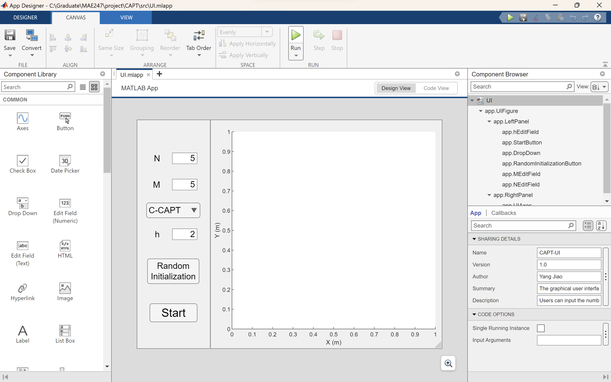
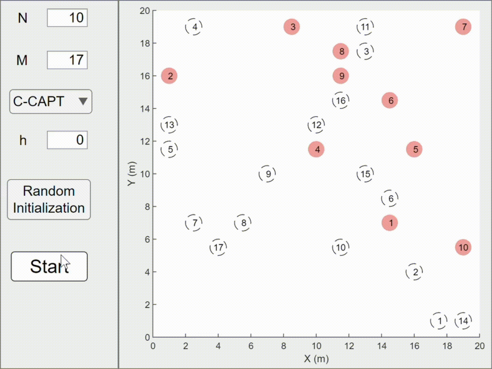
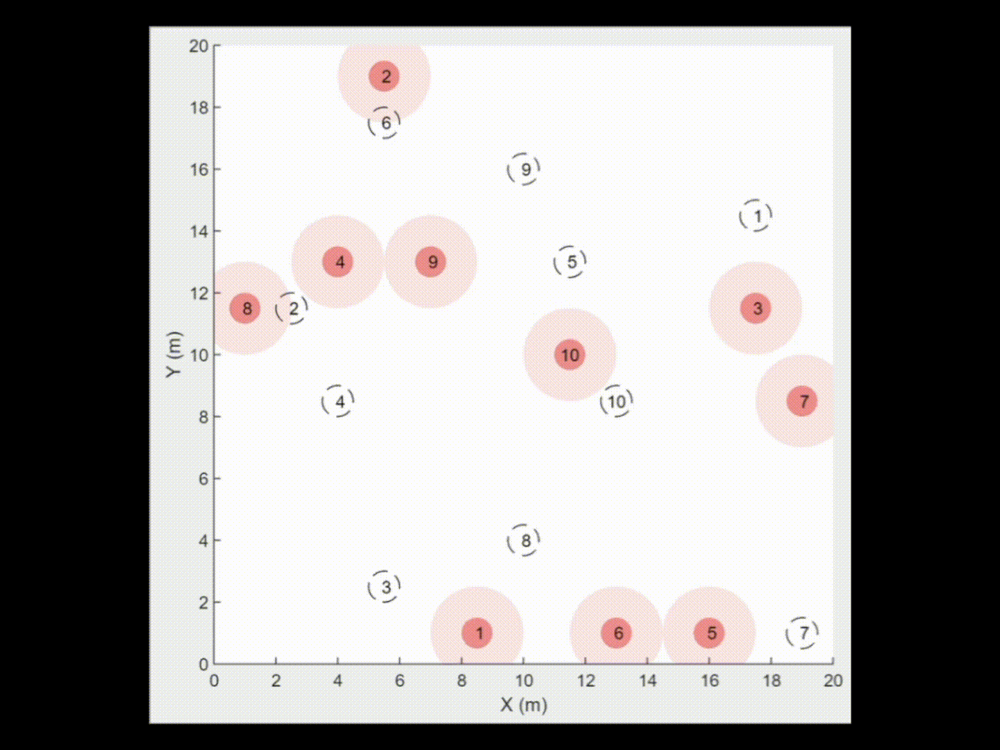
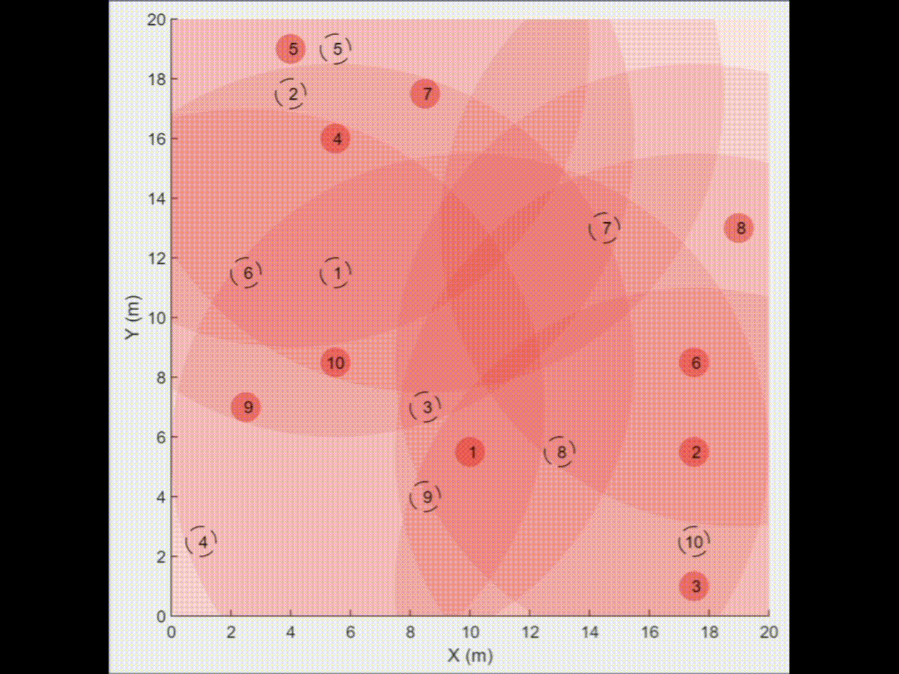

# CAPT: Concurrent Assignment and Planning of Trajectory

This repository is a course project of paper review.

Course: MAE247 - Cooperative Control of Multi-Agent Sytem @ University of California San Diego (SP23)

Author: Yang Jiao

[Link to the original paper here](https://journals.sagepub.com/doi/10.1177/0278364913515307)

This is an re-implementation of the CAPT algorithm, both centralized and decentralized versions. All of the implementation was finished in MATLAB *R2022b*. The execution can be performed by open `src/UI.mlapp` in **MATLAB App Designer** as shown below, and click on the `Run` button.

## C-CAPT Simulation

Simulation on centralized CAPT algorithm:

## D-CAPT Simulation

Simulation on decentralized CAPT algorithm:

$$
h = 1.5 \text{m}
$$

$$
h = 3 \text{m}
$$

$$
h = 10 \text{m}
$$

